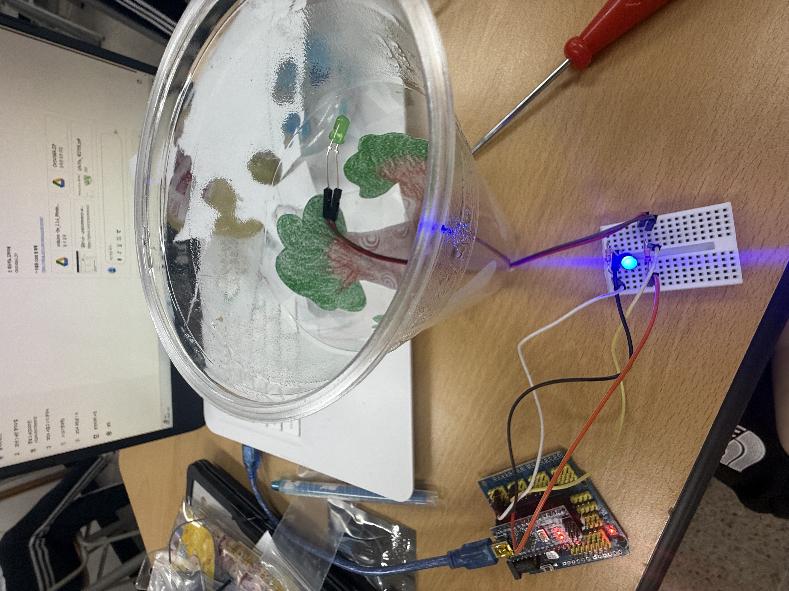

# 🌱 에코아트 프로젝트: [작품명]

## 📖 프로젝트 개요
- **제작자**: [박민서]
- **제작일**: [25.07.16]
- **소개> 그냥 버려지는 패트병을 이용해서  숲을 만들었다. 
## 📦 사용 재료
- 아두이노, 온도센서, LED, 브레드보드
- 패트병, 종이,색연필,가위

## 🔧 제작 과정

### 1단계: 아이디어 스케치

- 버려진 플라스틱 쓰레기를 이용해서 숲을 만들었고,종이에 나무와 구름을 그려서 숲을 표현하였다.
  
### 2단계: 완성품

## 💭 제작 후기
### 잘된 점
- 내가 생각한거와 똑같이 나온것 같다. 버려진 플라스틱을 재활용 하여 환경 보호의 의미를 잘 살려낸 것 같다.

### 아쉬운 점
- 생각 보다 시간이 많이 없어서 완성도가 높지 않아서 아쉬웠다.

### 개선할 점
- 버려진 플라스틱이 새로운 형태의 ‘생명’과 ‘풍경’으로 재탄생함으로써, 폐기물이 다시 가치 있는 자원으로 쓰일 수 있다는 메시지를 전달합니다.
즉, 플라스틱을 단순히 버리는 것이 아니라, 재활용과 재사용을 통해 환경 부담을 줄일 수 있음을 강조합니다.

### 내가 이미 알고 있었던 것
- 플라스틱이 환경 오염 주범이라는 것을 알고 있었다.
- 
### 새롭게 배운게 된 것
- 아두이노를 알지 못했는데 이번 활동을 통해 알았고 깃 허브 라는 앱도 처음 배웠는데 재미있었다

### 더 알고 싶은 것
- 아두이노를 어떻게 사용하는지 더 알고 싶다.

## 🌍 환경적 의미
-우리가 일상에서 버리는 플라스틱 쓰레기가 실제로 얼마나 많이 쌓이고, 자연을 위협하는지 눈에 보이게 보여줍니다. 눈에 보이는 ‘숲’ 형태로 만들어 환경오염 문제를 보다 직관적으로 이해할 수 있게 합니다.
버려진 플라스틱이 새로운 형태의 ‘생명’과 ‘풍경’으로 재탄생함으로써, 폐기물이 다시 가치 있는 자원으로 쓰일 수 있다는 메시지를 전달합니다.
즉, 플라스틱을 단순히 버리는 것이 아니라, 재활용과 재사용을 통해 환경 부담을 줄일 수 있음을 강조합니다.

## 📚 참고 자료
- [환경 관련 웹사이트](링크)
- [참고한 에코아트 작품](링크)

## 🏷️ 태그
#에코아트 #재활용 #환경보호 #DIY #창의활동

---

> 이 프로젝트는 환경 보호와 창의적 사고를 위한 교육 목적으로 제작되었습니다.
